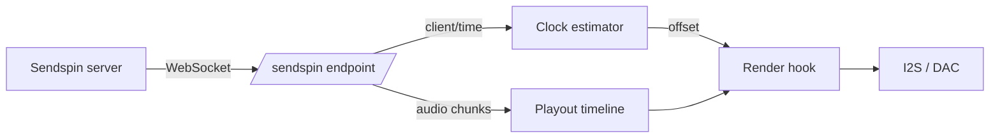

# Sendspin (experimental)

[Sendspin](https://github.com/Sendspin/sendspin-cpp) is an open multi-room audio protocol: a
server pushes timestamped audio chunks to every player over a WebSocket, and each player
schedules them against a shared clock. This firmware can act as a Sendspin **player**,
sharing the same output path, DSP and volume control that AirPlay uses.

!!! warning "Experimental — PCM only, and unpaired"

    The transport is encrypted, but the board cannot yet *pair*, so it authenticates with
    the protocol's published Sentinel PSK. That proves nothing about who is on the other
    end — it only stops a passive listener. FLAC and Opus are not implemented either, so
    the server must be willing to send raw PCM.

## What works

- Discovery: the board advertises `_sendspin._tcp`
- The full `client/init` → `server/init` → Noise handshake → `server/hello` →
  `client/hello` → `server/activate` sequence
- An **encrypted** transport: Noise `KKpsk2` over Curve25519, ChaCha20-Poly1305 and
  SHA-256, keyed with the Sentinel PSK
- Continuous clock sync, so playback is aligned with the server rather than free-running
- The `player@v1` role: 16- and 24-bit PCM, mono or stereo, 8–192 kHz in, played out as
  44.1 or 48 kHz stereo
- Stream start, clear and end, including re-anchoring when the server jumps

## What does not

- **Pairing.** The board advertises no pairing method, so it can only take part in an
  `unpaired_access` session. See [Encryption and pairing](#encryption-and-pairing)
- **Re-handshaking.** A second `noise/handshake` mid-session closes the connection instead
  of rekeying
- **FLAC and Opus.** The server must be told to send PCM
- **Commands.** The client advertises no `supported_commands`, so the server will not send
  volume or transport requests. Use the [web UI](../reference/spiffs.md) or
  [hardware buttons](buttons.md) instead
- The controller, metadata, artwork and visualizer roles

## How it works

The Sendspin endpoint lives on the existing web server, at `ws://<board>/sendspin`. No
second HTTP server is started; the endpoint costs one URI handler and two sockets.



Audio chunks carry a server timestamp. The clock estimator turns the four-timestamp
`client/time` exchange into a local-to-server offset, filtering out samples whose round
trip was slow and fitting a straight line through the rest so it tracks the two crystals
drifting apart. Chunks are then re-cut into fixed 512-frame blocks and filed in a playout
timeline by their position on the server's clock. On every I2S refill the render hook asks
where the DAC will actually be when those samples emerge, converts that to server time, and
pulls the matching block.

That is the same machinery AirPlay uses — Sendspin simply supplies a different clock and a
different transport.

## Encryption and pairing

Sendspin has no cleartext mode. Only three message types ever travel in the open —
`client/init`, `server/init` and `noise/handshake` — and everything after them is a Noise
transport message in a binary WebSocket frame, whose first decrypted byte says what kind of
Sendspin message it holds.

The handshake is `Noise_KKpsk2_25519_ChaChaPoly_SHA256`. Both static keys are known in
advance: the server learns the board's from the `client_id` in `client/init`, and the board
learns the server's from the `server_id` in `server/init`. The prologue is the raw bytes of
those two messages, so anything that tampers with them fails the handshake. The server is
the Noise initiator; the board is the responder.

That leaves the pre-shared key, and this is where "unpaired" comes in. A paired client and
server share a secret established during pairing. This firmware does not implement pairing,
so it uses the **Sentinel PSK** — a fixed value published in the protocol specification and
known to everybody:

```
psk    = SHA-256("sendspin-sentinel-psk-v1")
psk_id = base64url(SHA-256("sendspin-psk-id-v1" ‖ psk))
```

A Sentinel session is therefore **encrypted and tamper-evident, but not authenticated**:
nothing about it proves the server is the one you meant. That is why the specification only
lets a Sentinel-keyed session do pairing or, if the client asks for it, playback — and why
the board sets `unpaired_access.enabled` to say that it does. Servers are expected to make
a human approve the device before sending it anything.

If the server names a PSK the board has never held — usually a stale pairing record on the
server side — the board logs a warning and answers with the Sentinel anyway. That is the
specification's Sentinel Fallback, and the handshake then either succeeds unpaired or fails
silently, depending on which key the server actually used.

!!! tip "Music Assistant"

    Add the board with an explicit port, `<ip>:80` — a bare address is assumed to be on
    Sendspin's default port and will not connect. Then **approve** the device when Music
    Assistant asks: until you do, it activates the connection with an empty activity set and
    no audio will flow. You will not be asked for a password.

!!! note "Sendspin gets its own timeline"

    It does not share AirPlay's. The two are never active at the same time, but AirPlay's
    timeline is deliberately never torn down once created, so sharing it would mean
    reaching into a buffer the playback task is reading from.

## Coexistence

Sendspin, AirPlay and [Bluetooth](bluetooth.md) are **mutually exclusive at runtime**, the
same arrangement Bluetooth and [USB audio](usb-audio.md) already have:

- A Sendspin stream suspends the AirPlay services; they come back when it ends
- While Bluetooth or the USB host is streaming, the board reports itself **unavailable** to
  the Sendspin server, so it is skipped rather than dropped mid-song

## Building

Sendspin is off by default. Layer `config/sdkconfig.defaults.sendspin` onto a board's own
defaults, or use the ready-made environment:

```bash
pio run -e esp32s3-sendspin -t upload
```

It needs **PSRAM**, so it is unavailable on boards without it.

| Option | Default | Purpose |
| --- | --- | --- |
| `CONFIG_SENDSPIN_ENABLE` | `n` | Build and advertise the player role |
| `CONFIG_SENDSPIN_TIMELINE_BLOCKS` | `192` | Playout depth, in 512-frame blocks |
| `CONFIG_SENDSPIN_RX_BUFFER_SIZE` | `32768` | Largest message accepted from the server |
| `CONFIG_SENDSPIN_TIME_SYNC_INTERVAL_MS` | `2000` | Steady-state clock sync interval |

The defaults cost roughly **448 KB of PSRAM**: 384 KB for about 2.2 seconds of playout
timeline, and 64 KB for the receive and reassembly buffers.

## Identity

On first boot the board generates a Curve25519 key pair and stores the secret in NVS. The
public key, Base64url encoded, is the `client_id` the server sees, and it is stable across
reboots and firmware updates. The same key pair is the board's Noise static key, so
erasing the `sendspin` NVS namespace gives the board a new identity and invalidates any
pairing a server has recorded for it.

## Caveats

- The session is encrypted but **not authenticated** — see
  [Encryption and pairing](#encryption-and-pairing). Treat an unpaired board the way you
  would treat any other device on a network you control
- The service is advertised on **port 80**, the web server's port, with the endpoint path in
  the TXT record. A server that ignores the SRV port and assumes Sendspin's default will not
  find it
- `send_ahead` on each chunk is ignored; the timestamp alone decides when audio plays
- If a chunk arrives after its slot has already been rendered it is dropped, which is
  audible as a gap rather than as drift
