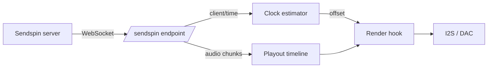

# Sendspin (experimental)

[Sendspin](https://github.com/Sendspin/sendspin-cpp) is an open multi-room audio protocol: a
server pushes timestamped audio chunks to every player over a WebSocket, and each player
schedules them against a shared clock. This firmware can act as a Sendspin **player**,
sharing the same output path, DSP and volume control that AirPlay uses.

!!! warning "First milestone — unencrypted and PCM only"

    This is a proving ground for the timing, not a finished implementation. The Noise
    transport, pairing, and the FLAC and Opus codecs are **not** implemented, so it will
    only connect to a server configured to accept an unauthenticated client sending raw
    PCM. Do not run it on a network you do not trust.

## What works

- Discovery: the board advertises `_sendspin._tcp`
- The `client/init` → `client/hello` → `server/activate` handshake, with an
  unauthenticated (`unpaired_access`) session
- Continuous clock sync, so playback is aligned with the server rather than free-running
- The `player@v1` role: 16- and 24-bit PCM, mono or stereo, 8–192 kHz in, played out as
  44.1 or 48 kHz stereo
- Stream start, clear and end, including re-anchoring when the server jumps

## What does not

- **Encryption.** A `noise/handshake` message is refused and the session is closed
- **Pairing.** Only `unpaired_access` sessions are accepted
- **FLAC and Opus.** The server must be told to send PCM
- **Commands.** The client advertises no `supported_commands`, so the server will not send
  volume or transport requests. Use the [web UI](../reference/spiffs.md) or
  [hardware buttons](buttons.md) instead
- The controller, metadata, artwork and visualizer roles

## How it works

The Sendspin endpoint lives on the existing web server, at `ws://<board>/sendspin`. No
second HTTP server is started; the endpoint costs one URI handler and two sockets.



Audio chunks carry a server timestamp. The clock estimator turns the four-timestamp
`client/time` exchange into a local-to-server offset, filtering out samples whose round
trip was slow and fitting a straight line through the rest so it tracks the two crystals
drifting apart. Chunks are then re-cut into fixed 512-frame blocks and filed in a playout
timeline by their position on the server's clock. On every I2S refill the render hook asks
where the DAC will actually be when those samples emerge, converts that to server time, and
pulls the matching block.

That is the same machinery AirPlay uses — Sendspin simply supplies a different clock and a
different transport.

!!! note "Sendspin gets its own timeline"

    It does not share AirPlay's. The two are never active at the same time, but AirPlay's
    timeline is deliberately never torn down once created, so sharing it would mean
    reaching into a buffer the playback task is reading from.

## Coexistence

Sendspin, AirPlay and [Bluetooth](bluetooth.md) are **mutually exclusive at runtime**, the
same arrangement Bluetooth and [USB audio](usb-audio.md) already have:

- A Sendspin stream suspends the AirPlay services; they come back when it ends
- While Bluetooth or the USB host is streaming, the board reports itself **unavailable** to
  the Sendspin server, so it is skipped rather than dropped mid-song

## Building

Sendspin is off by default. Layer `config/sdkconfig.defaults.sendspin` onto a board's own
defaults, or use the ready-made environment:

```bash
pio run -e esp32s3-sendspin -t upload
```

It needs **PSRAM**, so it is unavailable on boards without it.

| Option | Default | Purpose |
| --- | --- | --- |
| `CONFIG_SENDSPIN_ENABLE` | `n` | Build and advertise the player role |
| `CONFIG_SENDSPIN_TIMELINE_BLOCKS` | `192` | Playout depth, in 512-frame blocks |
| `CONFIG_SENDSPIN_RX_BUFFER_SIZE` | `32768` | Largest message accepted from the server |
| `CONFIG_SENDSPIN_TIME_SYNC_INTERVAL_MS` | `2000` | Steady-state clock sync interval |

The defaults cost roughly **448 KB of PSRAM**: 384 KB for about 2.2 seconds of playout
timeline, and 64 KB for the receive and reassembly buffers.

## Identity

On first boot the board generates a Curve25519 key pair and stores the secret in NVS. The
public key, Base64url encoded, is the `client_id` the server sees, and it is stable across
reboots and firmware updates. Erasing the `sendspin` NVS namespace gives the board a new
identity.

## Caveats

- The service is advertised on **port 80**, the web server's port, with the endpoint path in
  the TXT record. A server that ignores the SRV port and assumes Sendspin's default will not
  find it
- `send_ahead` on each chunk is ignored; the timestamp alone decides when audio plays
- If a chunk arrives after its slot has already been rendered it is dropped, which is
  audible as a gap rather than as drift
